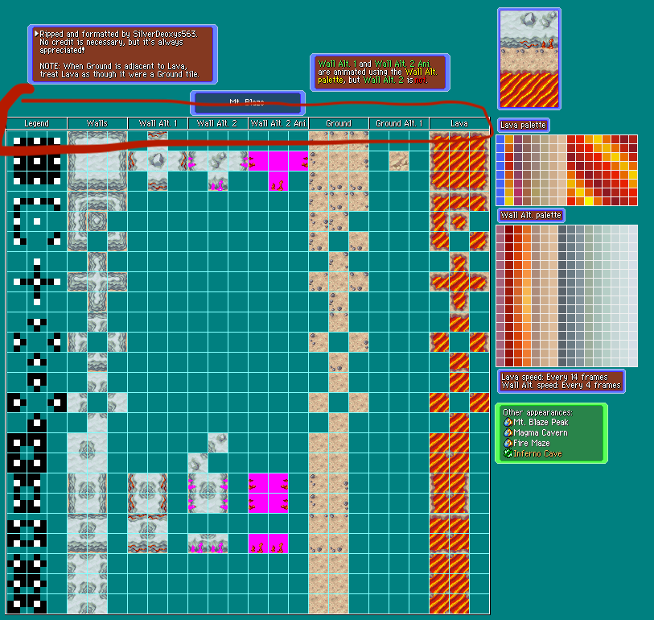

This is a Pokemon battle simulator that allows players to choose their own Pokemon and battle against an opponent.


# Pokémon Auto Battler Game

**Intro:**
This is a Pokemon battle simulator that allows players to choose their own Pokemon and battle against an opponent. In this game, players will assemble a team of Pokémon and strategically position them on a battlefield to engage in automated battles against both AI-controlled opponents and other players. The goal is to provide an engaging, tactical experience that captures the essence of the Pokémon universe while offering a unique gameplay twist.

## 🚀Getting Start

```
npm run build
```

or

```
yarn build
```
**To run the project:****
```
npm run dev
```

## Live Site

 https://naim08.github.io/Pokemon-TFT/


## Technologies Used

- HTML
- CSS
- JavaScript
- PIXI.js

## Features

### Feature 1: Pokemon Selection

Players can choose their own Pokemon from a list of available options.

#### Challenges Faced

One of the challenges faced while implementing this feature was ensuring that the selected Pokemon was added to the player's team and removed from the list of available options.

#### Solutions

To overcome this challenge, I created a function that would add the selected Pokemon to the player's team and remove it from the list of available options.

#### Code Snippet

```javascript
function selectPokemon(pokemon) {
  // Add the selected Pokemon to the player's team
  playerTeam.push(pokemon);

  // Remove the selected Pokemon from the list of available options
  availablePokemon = availablePokemon.filter(p => p !== pokemon);
}
```

### Feature 2: Start Fight

Players can start a battle against an opponent by clicking the "Start Fight" button.

#### Challenges Faced

One of the challenges faced while implementing this feature was disabling the interactivity of the Pokemon objects on the board when the battle started.

#### Solutions

To overcome this challenge, I created a function that would disable the interactivity of all Pokemon objects on the board when the "Start Fight" button was clicked.

#### Code Snippet

```javascript
function startFight() {
  // Disable interactivity of Pokemon objects on the board
  for (let row = 0; row < board.length; row++) {
    for (let col = 0; col < board[row].length; col++) {
      board[row][col].interactive = false;
    }
  }

  // Start the battle
  battle();
}
```
Feature 3: Find Shortest Path
Players can find the shortest path between two points on the board.

Challenges Faced
One of the challenges tilefaced while implementing this feature was finding the shortest path between two points on the board.

Solutions
To overcome this challenge, I used the FindShortestPath class to calculate the shortest path between two points on the board.

### Code Snippet

```javascript
const path = new FindShortestPath(matrix);
const shortestPath = path.findShortestPath(startRow, startCol, endRow, endCol);
```
## Feature 4: Mask

The ```mask.js``` file is used to create masks for the tileset. Basically ```mask.js``` is a JavaScript file that is used to create masks for a tileset. It exports a Masker class that has a mask8bits method which takes a matrix, row, and column as arguments and returns a mask value based on the surrounding values in the matrix. The IdTable object contains the mapping of mask values to their corresponding mask types. The masks are used to determine how tiles in the tileset should be rendered based on their surrounding tiles.

### Challenges Faced
One of the challenges faced while implementing this feature was understanding how the masks were created and used in the tileset.


### Code Snippet
MaskCoordinate is a class in mask.js that represents a coordinate on the tileset. It has x and y properties that represent the x and y coordinates of the tile.

Masker is a class in mask.js that is used to create masks for the tileset. It has a mask8bits method which takes a matrix, row, and column as arguments and returns a mask value based on the surrounding values in the matrix. The IdTable object contains the mapping of mask values to their corresponding mask types. The masks are used to determine how tiles in the tileset should be rendered based on their surrounding tiles.

Here's an example:
```javascript
import { Masker } from './mask.js';

const masker = new Masker();

function getTileMask(matrix, row, col) {
  const mask = masker.mask8bits(matrix, row, col);
  return mask;
}

export { getTileMask };
```
In this example, getTileMask is a function that takes a matrix, row, and column as arguments and returns the mask value for the tile at that position in the matrix. The masker instance of Masker is used to calculate the mask value using the mask8bits method.

### One Last Thing:

The `IdTable` object in `mask.js` is used to map the 8-bit mask values to their corresponding mask types. The mask values are calculated by the `mask8bits` method of the `Masker` class based on the surrounding values in the matrix. The `IdTable` object contains the mapping of mask values to their corresponding mask types, which are used to determine how tiles in the tileset should be rendered based on their surrounding tiles.

For example, if the mask value is `0b0011`, which means that the tile has a neighbor to the north and east, the corresponding mask type is `Mask.AB1`. The `IdTable` object contains the mapping of `0b0011` to `Mask.AB1`, so the `mask8bits` method returns `Mask.AB1` for this mask value.

Here's an example of how the `IdTable` object is used in `mask.js`:

```javascript
export const IdTable = {
  0: Mask.NONE,
  1: Mask.A1,
  2: Mask.B1,
  4: Mask.C1,
  8: Mask.D1,
  3: Mask.AB1,
  5: Mask.AC1,
  9: Mask.AD1,
  6: Mask.BC1,
  10: Mask.BD1,
  12: Mask.CD1,
  7: Mask.ABC1,
  11: Mask.ABD1,
  13: Mask.ACD1,
  14: Mask.BCD1,
  15: Mask.ABCD1,
  // ...
};

export class Masker {
  mask8bits(matrix, row, col) {
    let m = 0;
    const v = matrix[row][col];
    m |= this.eq(matrix, row - 1, col, v) << 0;
    m |= this.eq(matrix, row, col + 1, v) << 1;
    m |= this.eq(matrix, row + 1, col, v) << 2;
    m |= this.eq(matrix, row, col - 1, v) << 3;
    m |= (m & 0b0011) == 0b0011 ? this.eq(matrix, row - 1, col + 1, v) << 4 : 0;
    m |= (m & 0b0110) == 0b0110 ? this.eq(matrix, row + 1, col + 1, v) << 5 : 0;
    m |= (m & 0b1100) == 0b1100 ? this.eq(matrix, row + 1, col - 1, v) << 6 : 0;
    m |= (m & 0b1001) == 0b1001 ? this.eq(matrix, row - 1, col - 1, v) << 7 : 0;
    return IdTable[m];
  }
}
```

In this example, the `mask8bits` method of the `Masker` class calculates the mask value based on the surrounding values in the matrix and returns the corresponding mask type using the `IdTable` object.



## Sound

Plays sound depennding stage in the game
## Future Directions

- Allow online play

Make sure to allot enough time to write your README and use proper Markdown formatting. You can refer to the links provided in the prompt for helpful resources on Markdown syntax and examples of great READMEs.
