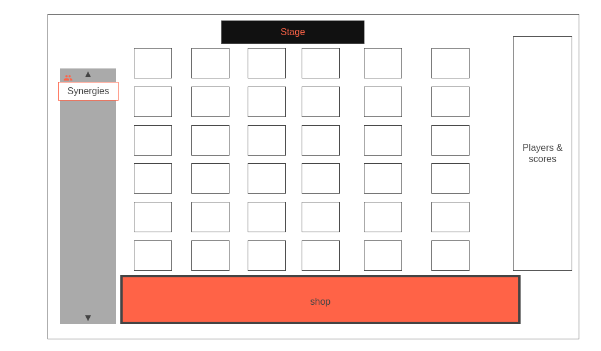

# **Project Proposal: Pokémon Auto Battler Game**

**Intro:**
**Proposal**: to create a Pokémon-themed auto battler game using vanilla JavaScript. This game will blend the captivating world of Pokémon with the strategic depth of auto battler gameplay. In this game, players will assemble a team of Pokémon and strategically position them on a battlefield to engage in automated battles against both AI-controlled opponents and other players. The goal is to provide an engaging, tactical experience that captures the essence of the Pokémon universe while offering a unique gameplay twist.

**Features:**
1. **Turn-Based Gameplay:** The game will feature a turn-based structure where players take actions during their turns, including selecting and positioning Pokémon, using abilities, and managing resources. The automated battles will unfold based on the chosen strategies and Pokémon synergies.

2. **Limited Pokémon Pool:** To encourage strategic thinking and diversity in team compositions, players will have access to a limited pool of Pokémon for each match. This pool will be shared among all players, adding an element of competition as players compete for the same Pokémon.

3. **Unit Synergies and Abilities:** Pokémon will possess distinct types, abilities, and stats. Players will strategically position their Pokémon on a grid-based battlefield to trigger synergies between types and abilities. Synergies will provide bonuses that enhance gameplay strategy.

**Technical Approach:**
We will develop the game using vanilla JavaScript, HTML, and CSS. The game will be structured around a game loop that handles the flow of rounds and turns. The user interface will allow players to select and position their Pokémon on the battlefield grid. Automated battles will be determined by JavaScript logic that calculates damage and applies abilities based on Pokémon attributes.

**Scope:**
The initial version of the game will focus on core gameplay mechanics, limited Pokémon types, and a basic AI opponent. Players will be able to engage in battles against the AI and make strategic decisions during their turns. Subsequent versions could expand the game by introducing features such as multiplayer modes, additional Pokémon types, and more advanced AI opponents.

**Conclusion:**
The Pokémon Auto Battler Game aims to combine the beloved Pokémon franchise with the engaging gameplay of auto battlers. By utilizing vanilla JavaScript and a turn-based structure, we will create a strategic experience that challenges players to think critically and make calculated decisions. This project aligns with the growing interest in both auto battlers and the Pokémon universe, making it an exciting and worthwhile endeavor.

# Functionality & MVP

1. **Basic Game Loop and Turns:**
   Set up the fundamental game loop that manages rounds and turns. Players should be able to take turns selecting and positioning their Pokémon on the battlefield.

2. **Limited Pokémon Selection:**
   Implement a basic mechanism for providing players with a limited pool of available Pokémon. This could involve randomly selecting a set of Pokémon for each round from a predefined pool.

3. **Unit Placement and Grid System:**
   Create a grid-based battlefield where players can position their Pokémon. Allow players to click on grid cells to place their Pokémon, and ensure that Pokémon can't be placed on occupied cells.

4. **Automated Battles and Damage Calculation:**
   Develop the logic for automated battles between players' Pokémon teams and AI-controlled opponents. Calculate damage based on Pokémon stats and types. Display battle outcomes to players.

5. **Basic Pokémon Abilities:**
   Introduce simple abilities for Pokémon that can affect battles. For instance, a Pokémon might have an ability that increases its attack for a turn or inflicts a status effect on an opponent.

6. **Win/Loss Condition and Restart:**
   Implement a win/loss condition that determines the outcome of battles. Display a victory or defeat message to players, and allow them to restart or continue to the next round.

**Bonus Features:**
If theres more time, I will focus enhancing  gameplay and overall experience by adding more features and depth. Here are some additional features:

1. **Advanced Pokémon Abilities:** Introduce a variety of unique and strategic abilities for Pokémon. Abilities could range from AoE (area of effect) attacks to healing abilities and abilities that interact with specific types or synergies.

2. **Unit Synergies:** Expand the system of unit synergies, allowing players to create more complex and rewarding combinations of Pokémon. These synergies could provide significant bonuses to encourage diverse team compositions.

3. **Diverse AI Opponents:** Develop a range of AI opponents with varying strategies, team compositions, and difficulty levels. This will add replayability and challenge for players who want to test their skills against different opponents.

4. **Upgrades and Evolution:** Implement a system where players can spend resources earned during battles to upgrade their Pokémon's stats or evolve them into more powerful forms. This adds a progression element to the game.

5. **Multiple Game Modes:** Introduce different game modes to cater to various player preferences. This could include a campaign mode with story elements, a casual mode for quick matches, and a ranked mode for competitive play.

6. **Multiplayer Support:** Playing with friends! Players could face off against each other in real-time matches, testing their strategies against human opponents.

7. **In-Game Shop:** Create an in-game shop where players can spend earned resources to purchase new Pokémon for their pool, unlock abilities, or obtain other upgrades to enhance their gameplay.

8. **Visual Enhancements:** Improve the game's visuals with more polished graphics, animations for abilities and battles, and an overall pleasing aesthetic.

9. **Sound and Music:** Add sound effects and background music to enhance the immersion and enjoyment of the game.

10. **Leaderboards and Achievements:** Implement a system to track player progress, achievements, and high scores. This can encourage replayability and competition among players.

11. **Tutorial and Help System:** Create a tutorial that guides new players through the mechanics of the game. Additionally, include a help system that provides information on abilities, types, and strategies.

12. **Dynamic Environments:** Introduce dynamic elements to the battlefield that can affect battles, such as terrain that provides bonuses or obstacles that hinder movement.

# Wireframes

**Technologies:**
1. **HTML, CSS, and Vanilla JavaScript:** These are the core technologies for creating the structure, styling, and interactive elements of your game.

2. **Canvas API:** Creating custom graphics and animations, the HTML5 Canvas API is useful for rendering dynamic 2D graphics.

3. **Node.js (Optional):** If you plan to deploy your game online or use build tools, Node.js can be useful for setting up a local development environment and using tools like npm (Node Package Manager).

4. **WebSocket or Networking Libraries (For Multiplayer):** For any multiplayer stuff.

**Libraries and APIs:**
1. **Pokémon API:** APIs like the Pokémon API (such as PokeAPI) can provide with a wealth of data about Pokémon, including names, types, abilities, and more.
2. **Sprite Libraries:** Sprite libraries or image repositories to find Pokémon sprites. Websites like Pokémon Database offer a wide range of sprites that you can use in your game.

3. **Sound and Music Libraries:** Libraries like Howler.js can help manage sound effects and background music in your game.

4. **Animation Libraries (Optional):** Libraries like GreenSock Animation Platform (GSAP) can simplify the creation of smooth animations and transitions.

**Assets:**
1. **Pokémon Sprites:** As mentioned earlier, will use Pokémon sprites on websites like Pokémon Database.

2. **Backgrounds and UI Elements:** You can create or source background images and user interface elements that match the Pokémon theme of your game.

3. **Sound Effects and Music:** Will use royalty-free music websites or sound effect libraries.

# Timeline

**Day 1 (Thursday): Setting Up and Laying the Foundation**
- Today, I'll set up my development environment, including my preferred code editor and version control using Git.
- I'll kick things off by creating the basic structure of my game's user interface using HTML. This will include the game board and any buttons or menus I need.
- My main goal for today is to get the core game loop and turn mechanics up and running. It's all about establishing the fundamental structure.

**Day 2 (Friday): Pokémon Data Integration and Grid System**
- I'll dive into the world of APIs and fetch Pokémon data like names, types, and stats from a Pokémon API.
- With the data on hand, I'll start working on a grid system that lets players position their Pokémon on the battlefield.
- Today is about ensuring that the Pokémon data is accurately displayed on the grid and that I can smoothly move on to the next steps.

**Day 3 (Saturday): Battling Mechanism and Adding Abilities**
- The focus for today is on developing the logic for automated battles between the Pokémon teams.
- I'll begin incorporating basic abilities and status effects for the Pokémon, which will add a layer of strategy to the battles.
- By the end of the day, I want to have working battles and abilities that make sense within the Pokémon universe.

**Day 4 (Sunday): Limited Pokémon Pool and Styling**
- I'll work on setting up a system that offers players a specific pool of Pokémon to choose from for each round.
- Aesthetics come into play today as I start styling the game's UI using CSS. I want to ensure the interface is visually appealing and intuitive.
- Testing the limited Pokémon pool is a priority, and I'll also focus on refining the overall visual experience.

**Day 5 (Monday): Enhancing User Interaction and Polish**
- Today's all about player interaction. I'll implement the functionality for players to place their Pokémon on the grid.
- While keeping the gameplay intact, I'll dedicate time to polishing up the visual elements and fine-tuning the UI layout.
- Testing user interaction is crucial to ensure everything feels smooth and responsive.

**Day 6 (Tuesday): Rigorous Testing and Debugging**
- I'm dedicating today to thoroughly testing every aspect of the game to catch any bugs or issues.
- I'll address any problems that arise during testing, ensuring the game is stable and functional.
- While the advanced features might not all be in place, I want to make sure that the core game is enjoyable and free from major glitches.

**Day 7 (Wednesday): Final Touches and Presentation Prep**
- The final day of development! I'll add any last-minute touches, such as sound effects or additional styling.
- I'll make sure that the game's user interface is user-friendly and intuitive for a seamless player experience.
- I'll get ready for the presentation, preparing any materials I'll need to showcase my Pokémon auto battler.

**Day 8 (Thursday): Presenting and Sharing the Project**
- Today's the big day. I'll present my Pokémon auto battler to my audience, explaining the core mechanics and features.
- I'll be attentive to the feedback and insights shared during the presentation.
- If it's applicable, I'll consider sharing my project on platforms like GitHub to showcase my work.

Throughout this timeline, I'll keep in mind that my main goal is to create a functional, bug-free game within the given timeframe. Additional features can always be added later if needed.
